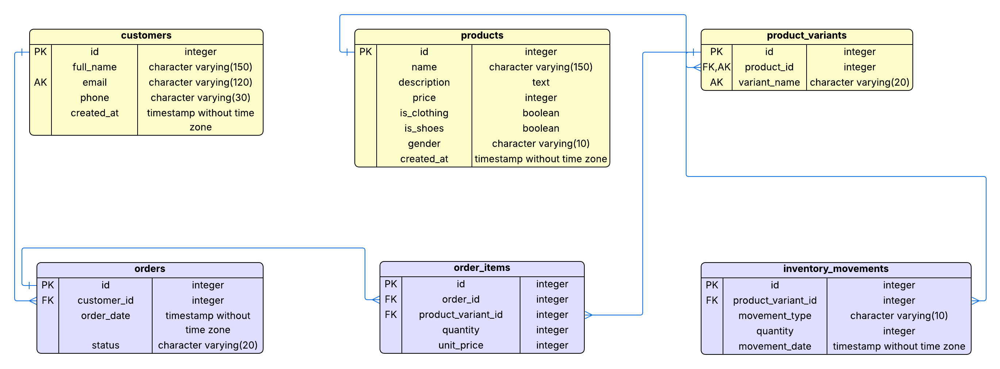

# 📘 Proyecto Base de Datos — E-Commerce (Módulo 3)

Este proyecto corresponde al **Módulo 3 del Bootcamp Full Stack Java – Talento Digital/SENCE**.

Implementa un sistema completo de base de datos para un E-Commerce, incluyendo:

- Modelo Entidad-Relación (ERD)
- Creación del esquema (`schema.sql`)
- Inserción de datos reales y consistentes (`data.sql`)
- Consultas SQL avanzadas (`queries.sql`)
- Uso de PostgreSQL + pgAdmin
- Repositorio limpio y estructurado

---

## 📌 1. Diagrama Entidad–Relación (ERD)

📍 Ubicación del archivo:  
`/diagrams/er.png`

### **Entidades modeladas:**
- **customers**
- **products**
- **product_variants**
- **inventory_movements**
- **orders**
- **order_items**

Todas con relaciones **1-N normalizadas**, claves primarias, claves foráneas y reglas de integridad.

---

## 📁 2. Estructura del Proyecto

ecommerce-db-m3/
│
├── diagrams/
│ └── er.png
│
└── sql/
├── schema.sql # Creación de tablas y relaciones
├── data.sql # Inserción de datos reales
├── queries.sql # Consultas SQL avanzadas
└── README.md # Documentación técnica del módulo


---

## 🧩 3. Requisitos

- PostgreSQL **12+**
- pgAdmin **4**
- Conexión local configurada

---

## 🚀 4. Cómo ejecutar el proyecto en pgAdmin

### ✔️ 4.1 Crear la base de datos

1. Abrir **pgAdmin**  
2. Crear una base de datos nueva llamada:

ecommerce_db_m3


3. Abrir **Query Tool**

---

### ✔️ 4.2 Ejecutar `schema.sql`

📍 Ruta:  
`/sql/schema.sql`

Este script:

- Elimina tablas previas con **DROP TABLE … CASCADE**
- Crea todas las entidades del sistema
- Define claves primarias y foráneas
- Aplica restricciones, validaciones y relaciones

➡️ **Ejecutar completo, de arriba hacia abajo.**

---

### ✔️ 4.3 Ejecutar `data.sql`

📍 Ruta:  
`/sql/data.sql`

Este script inserta:

- 🟢 **10 clientes**
- 🟢 **12 productos reales**
- 🟢 **40 variantes asociadas**
- 🟢 **Movimientos de inventario IN/OUT**
- 🟢 **6 órdenes completas**
- 🟢 **12 ítems en order_items**

Todos los datos están validados y vinculados correctamente.

---

### ✔️ 4.4 Ejecutar `queries.sql`

Incluye **12 consultas avanzadas**:

- Búsqueda con `ILIKE`
- JOINs múltiples
- Stock por variante
- Stock total por producto
- Órdenes + clientes
- Detalle completo de orden
- Clientes con más compras
- Productos más vendidos
- Ventas totales del negocio
- Variantes sin stock
- Movimientos de inventario

---

## 🔍 5. Verificaciones recomendadas

Después de poblar la base de datos, ejecutar:

```sql
SELECT COUNT(*) FROM customers;          -- 10
SELECT COUNT(*) FROM products;           -- 12
SELECT COUNT(*) FROM product_variants;   -- 40
SELECT COUNT(*) FROM inventory_movements;
SELECT COUNT(*) FROM orders;             -- 6
SELECT COUNT(*) FROM order_items;        -- 12

⭐ 6. Consultas destacadas

🔎 6.1 Buscar productos por nombre
sql

SELECT *
FROM products
WHERE name ILIKE '%zapatilla%';

📦 6.2 Stock actual por variante
sql

SELECT
    v.id,
    p.name,
    v.variant_name,
    SUM(
        CASE WHEN m.movement_type = 'IN' THEN m.quantity
             ELSE -m.quantity END
    ) AS stock_actual
FROM product_variants v
JOIN products p ON p.id = v.product_id
JOIN inventory_movements m ON m.product_variant_id = v.id
GROUP BY v.id, p.name, v.variant_name
ORDER BY v.id;

💰 6.3 Ventas totales del negocio
sql

SELECT SUM(oi.quantity * oi.unit_price) AS total_ingresos
FROM order_items oi;

❗ 6.4 Variantes sin stock
sql

SELECT
    v.id,
    p.name,
    v.variant_name
FROM product_variants v
LEFT JOIN inventory_movements m ON m.product_variant_id = v.id
JOIN products p ON p.id = v.product_id
GROUP BY v.id, p.name, v.variant_name
HAVING SUM(
    CASE WHEN m.movement_type='IN' THEN m.quantity
         ELSE -m.quantity END
) <= 0;

👤 7. Autora
Constanza Jofré Montecinos
Bootcamp Desarrollador Full Stack Java — 2025
Talento Digital para Chile / SENCE

---

🔗 [Repositorio público en GitHub](https://github.com/conijofremont/ecommerce-db-m3/tree/master)


📄 8. Licencia
Proyecto académico para evaluación del Módulo 3.
Uso permitido únicamente para fines formativos.


